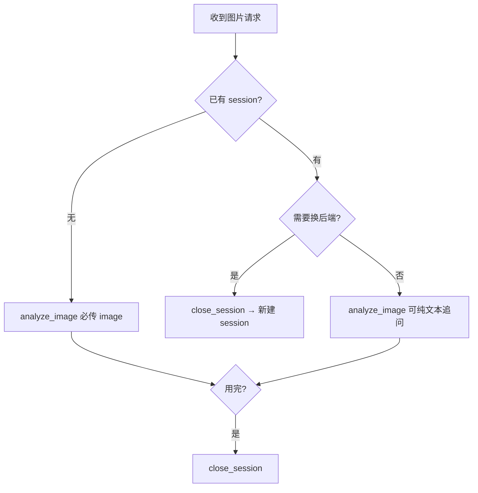

# Using VLM-MCP

## Overview

通过 VLM-mcp MCP 工具对图片进行单次分析、模板处理或多轮对话。核心原则：无会话必传图，有会话可追问，用完必须关。

## 触发场景

用户提供图片并要求：描述、分析、OCR 提取文字、图表解读、翻译图中文字、基于图片问答。

**不用此 skill 的场景：** 纯文本分析（无图片）、非 VLM-mcp 工具的图片处理。

## 决策流程



## 可用工具

| 工具 | 用途 |
|------|------|
| `analyze_image` | 传图片 + 问题/模板，返回分析结果 |
| `create_session` | 创建会话，用于多轮追问 |
| `close_session` | 关闭会话 |
| `list_sessions` | 查看当前活跃会话 |
| `list_backends_tool` | 查看可用模型后端 |
| `list_templates` | 查看内置 prompt 模板 |

## 快速参考

所有工具通过 `run_mcp(server_name="vlm-mcp", tool_name="...", args={...})` 调用：

| 操作 | 调用方式 |
|------|----------|
| 描述图片 | `run_mcp("vlm-mcp", "analyze_image", args={"image": "x.png", "prompt": "描述这张图片"})` |
| OCR 提取 | `run_mcp("vlm-mcp", "analyze_image", args={"image": "x.png", "template": "ocr"})` |
| 图表解读 | `run_mcp("vlm-mcp", "analyze_image", args={"image": "x.png", "template": "chart"})` |
| 翻译图中文字 | `run_mcp("vlm-mcp", "analyze_image", args={"image": "x.png", "template": "translate", "params": {"target_lang": "英文"}})` |
| 图片问答 | `run_mcp("vlm-mcp", "analyze_image", args={"image": "x.png", "template": "qa", "params": {"question": "..."}})` |
| 多轮追问 | `create_session` → `analyze_image(..., session_id="x")` → `close_session("x")`（详见下方多轮对话） |
| 查看活跃会话 | `run_mcp("vlm-mcp", "list_sessions")` |
| 查看可用后端 | `run_mcp("vlm-mcp", "list_backends_tool")` |

## 使用模式

### 模板分析
先用 `list_templates` 查看可用模板，再按上方快速参考表调用（独立调用，无需 session）。

### 多轮对话
```python
# 1. 创建会话
run_mcp("vlm-mcp", "create_session")                               # → {"session_id": "x"}

# 2. 首轮必须带图
run_mcp("vlm-mcp", "analyze_image", args={
    "image": "doc.png", "prompt": "总结本文", "session_id": "x"
})

# 3. 追问可纯文本（不传 image）
run_mcp("vlm-mcp", "analyze_image", args={
    "prompt": "第三节说了什么？", "session_id": "x"
})

# 4. 任意轮可带新图
run_mcp("vlm-mcp", "analyze_image", args={
    "image": "another.png", "prompt": "这张呢？", "session_id": "x"
})

# 5. 用完必须关
run_mcp("vlm-mcp", "close_session", args={"session_id": "x"})
```

## 常见错误

| 错误 | 现象 | 正确做法 |
|------|------|----------|
| 无会话忘传 `image` | `analyze_image(prompt="描述")` 报错 | 无会话时 `image` 必传 |
| 不关会话 | 占槽位，后续创建失败 | 用完 `close_session(session_id)`；若已占槽，先用 `list_sessions` 查孤儿会话再逐一关闭 |
| 同时传 `template` 和 `prompt` | `template` 优先，`prompt` 被忽略 | 只传其中一个 |
| 会话内换后端 | session 创建时绑定后端，无法切换 | 新建 session 换后端 |
| `image` 用相对路径 | MCP 服务端找不到文件 | 使用绝对路径（如 `D:/images/photo.png`），或确认文件在 MCP 服务端工作目录下 |

## 自查清单

每次调用 `analyze_image` 前确认：
- [ ] 无 session 时是否传了 `image`？
- [ ] 是否同时传了 `template` 和 `prompt`（只应传一个）？
- [ ] `image` 是否用了绝对路径？
- [ ] 换后端时是否先关了旧 session？
- [ ] 用完 session 是否调了 `close_session`？